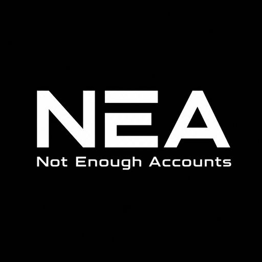

<div align="center">
  

# NEA

**Not Enough Accounts · Windows 本地多平台账号工作台**

[](https://github.com/M4rkzzz/NEA/releases/latest)
[](#运行环境)
[](https://tauri.app/)

[下载最新版](https://github.com/M4rkzzz/NEA/releases/latest) · [查看 Releases](https://github.com/M4rkzzz/NEA/releases) · [反馈问题](https://github.com/M4rkzzz/NEA/issues)
</div>

NEA 是面向 Windows 的本地多软件账号切换器，把 OOPZ、Steam 与完美世界竞技平台的账号资料、登录能力和常用入口收拢到一个桌面应用中。数据默认留在当前 Windows 用户目录，不依赖 NEA 自建云端服务。

> NEA 由 OOPZ+ 演进而来。升级时会兼容迁移旧版配置、账号快照、凭据、自启动项与 `.oopz+` 登录态包。

## 支持的平台

| 平台 | 主要能力 |
| --- | --- |
| OOPZ | 本地账号快照、一键切号、托盘与头像浮层、导入导出、加密通道快捷分享 |
| Steam | SteamID64 统一身份、网页登录、保存账密登录客户端、Steam Guard 状态识别、托盘切号 |
| 完美世界竞技平台 | 账号资料与筛选、网页授权同步、使用关联 Steam 账密打开客户端 |

## 主要能力

- 统一账号视图：按稳定身份合并不同来源的数据，保留网页能力、客户端账密和平台资料。
- Steam 稳定切号：通过已保存账密启动 Steam，持续核验进程与实际 `ActiveUser`，慢速网络下也会显示进度并进行失败恢复。
- Steam 网页批量导入：导入前后按 SteamID64 查重，识别密码错误、手机令牌和电子邮件验证，单个错误不会阻塞后续账号。
- 原生最近账号隔离：可将 NEA 账密登录的账号从 Steam 原生“切换账号”最近列表中安全移除，避免挤占五个位置。
- OOPZ 多入口切号：支持主界面、系统托盘与贴附浮层，并在切换前保存恢复点。
- 登录态迁移：分享中心可把所选 OOPZ、Steam 网页与完美平台状态导出为跨平台 `.nea-share` 包，也可使用 Magic Wormhole 一次性代码直接传输。
- 本地维护：会话缓存瘦身、孤立目录回收、事务恢复和旧数据迁移都由应用内完成。

## 1.3.0 重点更新

- 新增 `.nea-share` 手动导出与导入，可统一迁移所选 OOPZ、Steam 网页登录态和完美平台附加数据。
- Magic Wormhole 保留设备直连，需要中继时只使用免费的 Winden / Least Authority 公共中继；网络不理想时可直接改用文件传递。
- 分享接收严格校验 Steam Cookie 域与 SteamID64、ZIP 清单和路径、OOPZ UID 绑定及完美平台 SQLite 数据库。
- Steam 网页和完美平台导入改为先暂存、再提交，支持安全取消、失败逆序回滚和异常退出后的启动恢复。
- 大包传输不再被连接阶段的 10 分钟时限截断，打包和解包过程复用缓冲区并持续响应取消。
- 分享选择上限、半选状态、进度、错误与完成提示更加直观，并完善深色模式和完美平台刷新。
- 完美平台分享继续附带对应 Steam 网页登录能力；分享包始终不包含 Steam 客户端密码。
- 开发验证精简为 5 项核心回归，74 项稳定测试与 Clippy 仅在 Release 阶段运行；MSI 只在本地构建后上传。

完整变更与安装包见 [NEA v1.3.0 Release](https://github.com/M4rkzzz/NEA/releases/tag/v1.3.0)。

## 安装与使用

1. 从 [Releases](https://github.com/M4rkzzz/NEA/releases/latest) 下载 `NEA_1.3.0_x64_en-US.msi`。
2. 安装并打开 NEA；首次启动会自动检查旧 OOPZ+ 数据并执行兼容迁移。
3. 在左侧选择平台，根据页面提示识别程序路径、导入账号或登录一次。
4. 后续可从账号列表、托盘菜单或 OOPZ 浮层快速切换。

Steam Guard、手机确认和邮件验证仍由 Steam 官方页面或客户端完成。NEA 不绕过任何二次验证。

## 安全与隐私

请在使用前了解以下边界：

- **Steam 用户名和密码以明文保存在 `%APPDATA%\NEA\config.json`。** 只应在可信的个人 Windows 账户和受控设备上启用此能力，并妥善保护该文件、系统备份与远程访问权限。
- `.nea-share`、OOPZ `.nea` 和旧 `.oopz+` 包不包含 NEA 保存的 Steam 密码，但会包含可用于登录的本地或网页状态，仍属于敏感文件，应仅通过可信渠道传递并及时删除；文件落盘后不再额外加密。
- 完美平台分享会同时携带关联账号的 Steam 网页登录态，这是完美网页授权所需的组合能力；仍不会包含 Steam 客户端密码。
- Magic Wormhole 快捷分享使用一次性代码和端到端加密通道；连接协商支持设备直连，需中继时只使用免费的 Winden / Least Authority 公共中继，不再竞速旧的慢中继。中继服务不能读取包内容，但速度与可用性仍受公共服务和双方网络影响；网络不理想时可导出 `.nea-share` 包自行传递。
- 生成和接收快捷分享时会短暂创建未额外加密的本地包；提交阶段的回滚记录位于 `%APPDATA%\NEA\recovery`。正常结束会立即删除，异常退出后会在下次主程序启动时先恢复 Steam/完美文件与配置，再回收已完成或未进入提交阶段的残留。
- NEA 不修改平台程序文件，不注入 DLL，不逆向登录协议，也不绕过 Steam Guard。
- NEA 默认只管理当前 Windows 用户的数据；共享 Windows 账户会扩大配置与登录态的可见范围。

## 数据目录

NEA 的稳定数据入口是 `%APPDATA%\NEA`：

```text
NEA/
├─ config.json                     主配置（包含已保存的 Steam 明文账密）
├─ config.json.bak                 主配置原子备份
├─ workspaces/
│  ├─ oopz/                        OOPZ 账号快照与切号备份
│  ├─ steam/web-sessions/          Steam WebView2 必要登录态
│  └─ perfect/avatars/             完美平台头像缓存
├─ runtime/                        Watcher 与更新运行状态
├─ recovery/                       可恢复事务数据
└─ legacy/                         旧目录迁移归档
```

Steam 会话只保留 Cookie、Local Storage 等必要状态。页面缓存、代码缓存、GPU/Shader 缓存和统计文件会在窗口关闭或“整理存储”时清理；升级后目录结构保持兼容，不要求用户手工移动文件。

## 运行环境

- Windows 10 x64 1709 或更高版本；推荐 Windows 10 22H2 / Windows 11。
- 不支持 32 位 Windows。
- 图形界面依赖 Microsoft Edge WebView2 Runtime；MSI 会在缺失时引导安装。
- Steam、OOPZ 和完美世界竞技平台的可用性仍受各自客户端、网络与账号安全策略影响。

## 本地开发

需要 Node.js、pnpm、Rust stable 和 Tauri 2 的 Windows 构建环境。

```powershell
pnpm install
pnpm run dev:app       # 开发运行
pnpm run check:fast    # 紧密开发循环：仅 TypeScript + Rust 增量检查
pnpm run verify:dev    # 功能完成：TypeScript + 5 项关键回归测试
pnpm run verify:release # 正式发布：构建 + 74 项稳定测试 + Clippy
pnpm run build:msi     # 构建 Windows MSI
```

开发期间不要反复运行发布验证；只有准备 Release 时才运行 `verify:release`。安装包输出到 `src-tauri/target/release/bundle/msi/`。生产构建会强制检查并嵌入前端入口，避免生成无法显示界面的安装包。

AI 或新维护者接手前请先阅读 [AI_HANDOFF.md](AI_HANDOFF.md)，其中记录了当前架构、不可变产品决策、验证纪律与已知边界。

## 常见问题

### 为什么 Steam 账号显示“需要账密”？

Steam 原生最近登录记录现在只作为名称和当前状态的参考，不再当作可靠登录能力。保存账密后，NEA 才能主动登录客户端；遇到 Steam Guard 时仍需按官方提示确认。

### NEA 会占用 Steam 原生切换账号的五个位置吗？

NEA 会记录通过自身账密登录的账号，并仅在 Steam 完全退出的安全窗口清理其“记住密码”、自动登录、最近标记和排序时间，尽量不占用原生最近列表。Steam 正在运行时不会改写该文件。

### 可以跨电脑迁移吗？

可以。分享中心支持将 OOPZ、Steam 网页会话和完美平台附加数据导出为一个 `.nea-share` 文件，也支持一次性码快捷传输；Steam 客户端账密不会写入分享包，需要在目标电脑单独保存。

### 升级会打乱 `%APPDATA%\NEA` 吗？

不会。`config.json` 保持稳定入口，其余数据按 `workspaces/runtime/recovery/legacy` 分层；迁移由程序执行，并保留旧版兼容路径与恢复数据。

## 许可证

本仓库当前未声明开源许可证。未经作者授权，请勿用于商业分发或二次发布。
